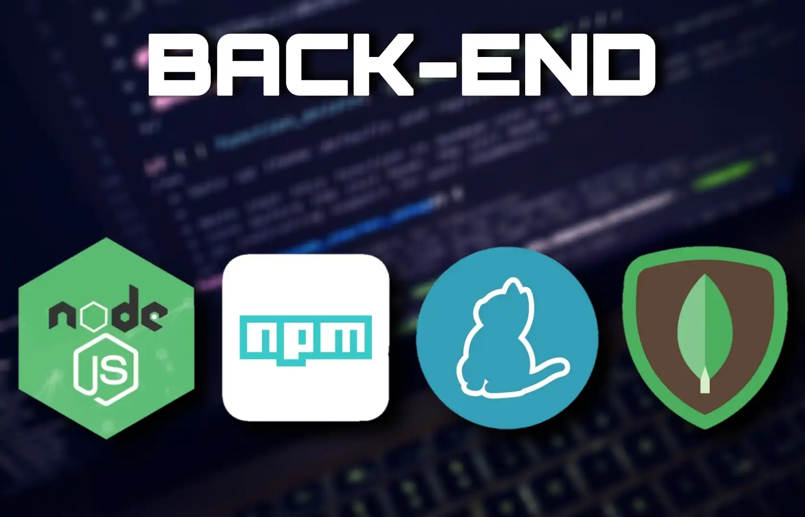
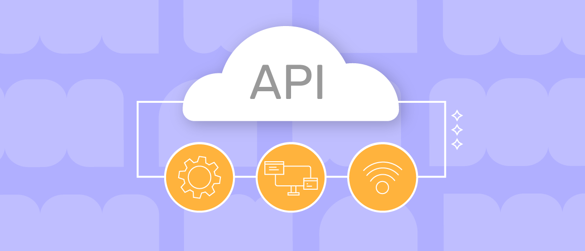

## Beckend, API e Conexão MySQL

## BACKEND 

## Componentes do Backend

1. **Servidores:** O backend opera em servidores que recebem e processam as requisições dos usuários. Quando um usuário acessa um site, o servidor backend é responsável por processar essa solicitação, buscar os dados necessários e enviá-los ao navegador.

2. **Bancos de Dados:** Os dados são armazenados em bancos de dados, que podem ser SQL (como MySQL e PostgreSQL) ou NoSQL (como MongoDB). O backend gerencia a criação, leitura, atualização e exclusão (CRUD) desses dados, garantindo que estejam organizados e acessíveis.

3. **APIs:** As APIs (Interfaces de Programação de Aplicações) permitem a comunicação entre diferentes sistemas. Elas são essenciais para integrar o backend com o frontend e outros serviços externos. O padrão REST é frequentemente utilizado para estruturar essas APIs.

## Linguagens e Tecnologias
O desenvolvimento backend pode ser realizado em várias linguagens de programação, incluindo:
* **JavaScript (Node.js):** Popular para aplicações em tempo real.
* **Python:** Usado com frameworks como Django e Flask.
* **Java:** Comumente usado em aplicações empresariais através de frameworks como Spring.
* **PHP:** Amplamente utilizado para desenvolvimento web dinâmico.
* **Ruby:** Frequentemente associado ao framework Ruby on Rails.

## Importância de um Bom Backend

*  **Um backend bem estruturado é crucial para garantir:**
Eficiência e Performance: Um sistema otimizado responde rapidamente às requisições dos usuários, proporcionando uma melhor experiência.
* **Segurança:** Implementar medidas de proteção é vital para proteger dados sensíveis contra ataques cibernéticos.
* **Escalabilidade:** Um backend eficiente permite que o sistema suporte um aumento no número de usuários sem comprometer a performance.
           

---

##  API 

As APIs (Interfaces de Programação de Aplicações) são fundamentais para a comunicação entre diferentes sistemas e aplicações. Elas permitem que desenvolvedores integrem funcionalidades de um software em outro, facilitando o acesso e a manipulação de dados.

## O que é uma API RESTful?

Uma API RESTful é uma implementação de uma API que segue os princípios do estilo arquitetônico REST (Representational State Transfer). Esse modelo foi definido por Roy Fielding em sua dissertação de doutorado em 2000 e é amplamente utilizado para criar serviços web escaláveis e flexíveis.

### Princípios do REST

As APIs RESTful são baseadas em algumas restrições principais:

1. **Cliente-Servidor**: A separação entre cliente e servidor permite que ambos evoluam independentemente.
  
2. **Sem Estado (Stateless)**: Cada requisição do cliente deve conter todas as informações necessárias para que o servidor a processe, sem depender de informações armazenadas no servidor.

3. **Cache**: As respostas devem ser rotuladas como cacheáveis ou não, para otimizar a performance das requisições.

4. **Interface Uniforme**: Uma interface padronizada facilita a comunicação entre cliente e servidor, permitindo que ambos evoluam sem dependências rígidas.

5. **Sistema em Camadas**: A arquitetura pode ser composta por várias camadas, o que ajuda na escalabilidade e modularidade.

6. **Code on Demand (opcional)**: Permite que o servidor envie código executável ao cliente, como scripts ou applets, conforme necessário.

## Funcionamento das APIs RESTful

O funcionamento básico de uma API RESTful envolve as seguintes etapas:

1. **Requisição**: O cliente envia uma requisição HTTP ao servidor, especificando o recurso desejado através de um URL (Uniform Resource Locator) e utilizando métodos HTTP como GET, POST, PUT ou DELETE.

2. **Processamento**: O servidor autentica a requisição e processa os dados solicitados.

3. **Resposta**: O servidor retorna uma resposta ao cliente, geralmente em formato JSON ou XML, contendo os dados solicitados ou informações sobre o status da operação.

## Vantagens das APIs RESTful

- **Escalabilidade**: A arquitetura REST permite que as aplicações sejam escaladas facilmente para suportar um grande número de usuários simultâneos.
  
- **Flexibilidade**: As APIs podem retornar dados em vários formatos (JSON, XML, etc.), permitindo que diferentes clientes consumam os dados conforme suas necessidades.

  **Desempenho**: O uso de cache e a natureza sem estado das requisições ajudam a melhorar o desempenho geral da aplicação.

## Conclusão

As APIs RESTful são essenciais para o desenvolvimento moderno de software, especialmente em ambientes de microserviços e aplicações baseadas em nuvem. Elas oferecem uma maneira eficiente e flexível para integrar diferentes sistemas, facilitando a troca de dados e a construção de aplicações robustas.

---

##  Conexão MySQL

Conectar um banco de dados MySQL por meio de um backend e uma API envolve alguns conceitos fundamentais que permitem a comunicação entre a aplicação e o banco de dados. Aqui está uma explicação conceitual sobre como essa conexão é estabelecida.

## Estrutura Geral

1. **Backend**: O backend é a parte da aplicação que processa a lógica de negócios, manipula dados e se comunica com o banco de dados. Ele atua como intermediário entre o cliente (frontend) e o servidor de banco de dados.

2. **API (Interface de Programação de Aplicações)**: A API permite que diferentes partes da aplicação se comuniquem. No contexto de uma aplicação web, a API expõe endpoints que o frontend pode chamar para realizar operações no banco de dados, como criar, ler, atualizar ou excluir dados (operações CRUD).

## Estabelecendo a Conexão

### 1. Configuração do Banco de Dados

Antes de estabelecer a conexão, é necessário garantir que o banco de dados MySQL esteja configurado corretamente. Isso inclui:

- **Instalação do MySQL**: O servidor MySQL deve estar instalado e em execução.
- **Criação do Banco de Dados**: Um banco de dados específico deve ser criado para armazenar as informações da aplicação.
- **Credenciais**: É necessário ter um nome de usuário e uma senha que permitam acesso ao banco de dados.

### 2. Conexão do Backend ao MySQL

O backend utiliza uma biblioteca ou driver específico para conectar-se ao MySQL. Esse driver permite que o código do backend envie comandos SQL ao banco de dados e receba respostas. O processo geralmente envolve:

- **Definição da Cadeia de Conexão**: A cadeia de conexão contém informações como o endereço do servidor MySQL, o nome do banco de dados, o nome de usuário e a senha.
  
- **Estabelecimento da Conexão**: Utilizando a cadeia de conexão, o backend se conecta ao banco de dados. Essa conexão pode ser persistente ou temporária, dependendo das necessidades da aplicação.

### 3. Interação com a API

Uma vez que a conexão com o banco de dados está estabelecida, a API pode expor endpoints que permitem interagir com os dados:

- **Endpoints CRUD**: A API define rotas para operações como:
  - **GET**: Para recuperar dados do banco.
  - **POST**: Para adicionar novos registros.
  - **PUT/PATCH**: Para atualizar registros existentes.
  - **DELETE**: Para remover registros.

- **Manipulação dos Dados**: Quando um endpoint é chamado, o backend executa os comandos SQL correspondentes para interagir com o banco de dados. Os resultados são então formatados (geralmente em JSON) e enviados como resposta ao cliente.

## Considerações Finais

A conexão entre um backend e um banco de dados MySQL via API é um processo essencial para aplicações modernas. Ele permite que os desenvolvedores criem aplicações dinâmicas que podem manipular grandes volumes de dados com eficiência. Além disso, seguir boas práticas na configuração da conexão e na definição da API é crucial para garantir segurança, desempenho e escalabilidade da aplicação.

